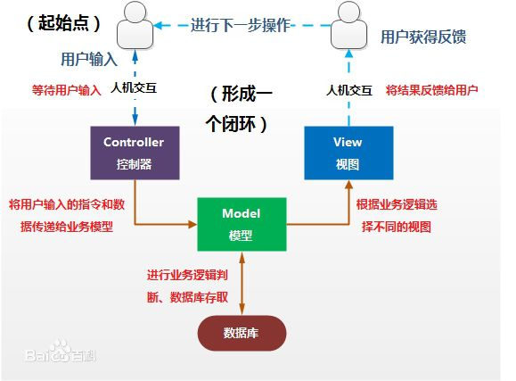
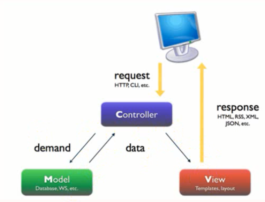

# Django介绍
### Django是一个用Python编写的开源的web应用框架。此系统采用了MVC的框架模式,也可称为MVT模式
#### 1.MVC模式
MVC模式全名Model View Controller,是模型，视图，控制器的缩写。通俗的理解MVC模式就是说强制性的使应用程序的输入，处理和输出分开

- Model:数据存取层，用于封装于应用程序的业务逻辑相关的数据，以及对数据的处理。说白了就是模型对象负责在数据库中存取数据。
- View：表现层，负责数据的显示和呈现。渲染的html页面给用户，或者返回数据给用户。
- Controller：业务逻辑层。负责从用户端收集用户的输入，进行业务逻辑处理，包括向模型中发送数据，进行CRUD操作。

图解： 
 
浏览器中MVC的表现形式图解: 
 
#### 2.MVT模式
- Model： 负责业务与数据库(ORM)的对象
- View： 负责业务逻辑并适当调用Model和Template
- Template: 负责把页面渲染展示给用户
>>注意:Django中还有一个url分发器，也叫作路由。主要用于将url请求发送给不同的View处理，View在进行相关的业务逻辑处理。

#### 3.B/S
Browser/Server（浏览器/服务器模式）
#### 4.C/S
Client/Server(客户机/服务器模式)
# 创建虚拟环境(windows)
1. 安装虚拟环境  **pip install virtualenv**
1. 创建虚拟环境  **virtualenv --no-site-package 文件名**
1. 进入虚拟环境 在Scripts文件夹下，进入**activate**，退出**deactivate**
# 安装Django
1. 安装Django  **pip install Django==1.11**
1. 创建项目  **django-admin startproject 项目名**
1. 启动Django项目  **python manage.py runserver ip:端口**
1. 创建app  **python manage.py startapp appname**
2. app 
\_\_init__.py:初始化 
admin.py:管理后台注册模型 
apps.py: settings.py里面注册app的时候推荐这样使用 
from app.apps import AppConfig 
AppConfig.name 
model.py: 写模型的地方 
views.py: 写处理业务逻辑的地方 
1. 迁移数据库(创建数据库表) 
创建更改的文件**python manage.py makemigrations** 
将生成的py文件应用到数据库**python manage.py migrate** 
>> **注:**这种方法可以在SQL等数据库中创建与models.py代码对应的表，不需要自己手动执行SQL。

# Django项目目录下文件及其相关设置
#### 1.创建一个Django项目，展开其目录后有以下文件:

**manage.py**： 是Django用于管理本项目的管理集工具，之后站点运行，数据库自动生成，数据表的修改等都是通过该文件完成。

**\_\_init__.py**： 指明该目录结构是一个python包，暂无内容，在后期会初始化一些工具会使用到。

**settings.py：** Django项目的配置文件，其中定义了本项目的引用组件，项目名，数据库，静态资源，调试模式，域名限制等

**urls.py：**项目的URL路由映射，实现客户端请求url由哪个模块进行响应。

**wsgi.py：**定义WSGI接口信息，通常本文件生成后无需改动
#### 2.settings.py文件配置
1. 设置语言为中文 
**LANGUAGE_CODE = 'zh-hans'** 表示中文
**LANGUAGE_CODE = 'en-us'** 表示英文
2. 设置时区 
UTC：世界标准时间，也就是平常说的零时区。
北京时间表示东八区时间，即UTC+8
**TIME_ZONE = 'Asia/Shanghai'**