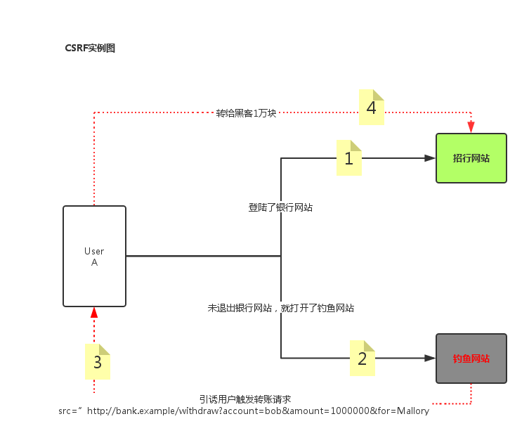

# 页面解析
## 1.加载静态配置文件
在settings.py中配置静态文件路径，新建一个static文件，主要用于加载模板中用到的资源，提供全局使用css，html，图片，文字文件等

    STATIC_URL = ‘/static/’
	STATICFILES_DIRS = [
    	os.path.join(BASE_DIR, ‘static’)
	]
之后再模板中，首先加载静态文件，之后调用静态，就不用写绝对全路径了

## 2.使用静态配置文件
1)加载渲染静态配置文件，在模板中声明

     或者 
在引用资源的时候使用
    	
	 xxx就是相当于staticfiles_dirs的一个位置

2)直接定义静态配置
    
	

## 3.模板摘要
### 1).模板主要有两个部分
a.HTML静态代码

b.动态插入的代码段(挖坑，填坑)也就是block

### 2).动态填充
模板中的动态代码还可以做一些基本的运算，如下
    
	
		男
	
		女
	
> 模板中的变量： 视图传递给模板的数据 标准标识符规则 语法 {{ var }} 如果变量不存在，则插入空字符串

### 3).模板中的点语法
对象.属性或者方法
    
	生日：{{ stu.stu_birth }}
	创建时间：{{ stu.stu_create_time }}
	语文成绩：{{ stu.stu_yuwen | add:-10 }}
	数学成绩：{{ stu.stu_math }}

### 4).弊端
调用对象的方法，不能传递参数

### 5).模板中的标签
语法 

作用：

-  加载外部传入的变量
-  在输出中创建文本
-  控制循环或逻辑

## 4.if和for
### if表达式
    
	

    

    

### for表达式
    
	

    

    
>注意：当列表为空或者不存在时，执行empty之后的语句

### 其他用法
    
	计数从0开始：{{ forloop.counter0 }} 
    计数从1开始：{{ forloop.counter }}
    计数从最后开始，到1停：{{ forloop.revcounter }}
    计数从最后开始，到0停：{{ forloop.revcounter0 }}
	是否是第一个,布尔值: {{forloop.first}}
	是否是最后一个,布尔值: {{forloop.last}}

## 5.注释
### 单行注释
    
	{# 被注释掉的内容 #}

### 多行注释
    
	
	
	

## 6.过滤器
定义: {{var|过滤器}}

作用: 在变量显示前修改 过滤器有很多，比如add/lower/upper

### 1).加法
    
	{{ p.page | add:5 }}
	{{ p.page | add: -5 }}

### 2).修改大小写
    
	lower / upper : {{ p.pname | lower }}

### 3).传参数
例如join： {{ student | join ‘=’ }} 如果值为空值设置为默认值:
    
	默认值：default 如果变量没有提供或为False，空，会使用默认值
	{{ var | default value }}

### 4).日期格式
    
	{{ dateVal | date:'y-m-d h:m:s' }}

### 5).是否转义
将接受到的数据渲染成html：
    
	{{ code | safe }} 
还可使用autoscape渲染：
    
	{{ autoscape off }}
	{{ endautoscape }}
不渲染的话
	{{ autoscape on }}
	{{ endautoscape }}
   
## 7.运算
### 1) 乘
    
	
### 2) 整除
    
	{{ num|divisibleby:2 }}
>注意：该语句的意思是，判断num值是否能被2整除，如果能的话返回True，不能的话返回False

### 3) ifeuqal判断相等
    
	

	 
## 8.反向解析
    
	

## 9.跨站请求CSRF(Cross Site Request Forgery)
某些而已网站包含链接，表单，按钮，js利用登录用户在浏览器重的认证信息，进行非法操作，攻击服务，破坏数据 
 
理解如下：

1. 在表单中添加 
1. 在settings中的中间件MIDDLEWARE中配置打开 ‘django.middleware.csrf.CsrfViewMiddleware’

## 10.模板继承
### 1) block挖坑
    
	关键字 block挖坑
	
	
### 2) extends
    
	extends 继承，写在开头位置
	
### 3) include
    
	include 加载模型进行渲染
	% include ‘模板文件’%}
例子：先写一个base.html文件挖坑
    
	<!DOCTYPE html>
	<html lang="en">
	<head>
    <meta charset="UTF-8">
    <title>
        
        
        
    </title>
	</head>
	<body>
    	
    
    	
	</body>
	</html>
然后可以写另外一个html文件填坑
    
	
	

	
    	学生列表
	

	
	    
	        学生id: {{ stu.id }}
	        学生名字: {{ stu.s_name }}
	        <a href="/s/delstu/?stu_id={{ stu.id }}">删除</a>
	        <a href="/s/upstu/?stu_id={{ stu.id }}">修改</a>
	         
	    
	