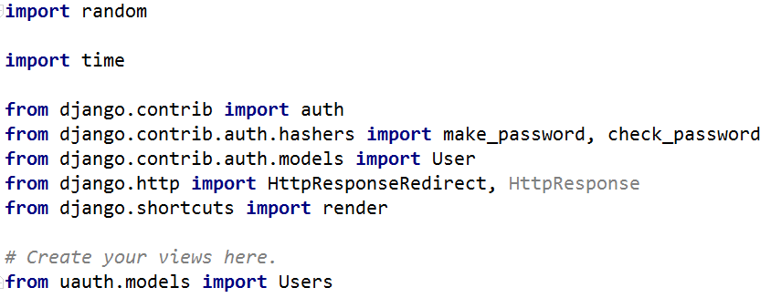
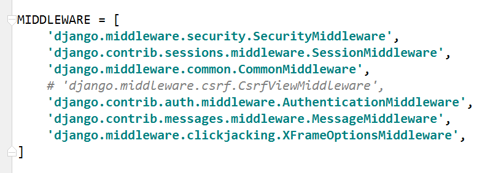
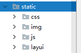

# 登录/注册/注销权限验证
新建一个记录用户信息的模型，包括的字段有用户名，用户密码，cookies的值ticket
    
	class Users(models.Model):
	    u_name = models.CharField(max_length=10)
	    u_password = models.CharField(max_length=255)
	    u_ticket = models.CharField(max_length=30, null=True)
	
	    class Meta:
	        db_table = 'users'

## 一、不使用Django自带的登录注册功能
### 1.设置url路径
需要先导入views文件：form uauth import views
    
	urlpatterns = [
	    url(r'^regist/', views.regist),
	    url(r'^login/', views.login),
	    url(r'^logout/', views.logout),
	]
### 2.添加相应的方法
需要导入的包有：

	def regist(request):
	    if request.method == 'GET':
	        return render(request, 'regist.html')
	
	    if request.method == 'POST':
	        # 注册
	        name = request.POST.get('name')
	        password = request.POST.get('password')
	        password = make_password(password)
	        Users.objects.create(
	            u_name=name,
	            u_password=password
	        )
	        return HttpResponseRedirect('/uauth/login/')

	
	def login(request):
	    if request.method == 'GET':
	        return render(request, 'login.html')
	
	    if request.method == 'POST':
	        # 如果登录成功，绑定参数到cookie中， set_cookie
	        name = request.POST.get('name')
	        password = request.POST.get('password')
	
	        if Users.objects.filter(u_name=name).exists():
	            user = Users.objects.get(u_name=name)
	            if check_password(password, user.u_password):
	                s = 'qwertyuiopasdfghjklzxcvbnm'
	                ticket = ''
	                for i in range(15):
	                    ticket += random.choice(s)
	                now_time = int(time.time())
	                ticket = 'Tk_' + ticket + str(now_time)
	                # 绑定令牌到cookie里面
	                # response = HttpResponse('登录成功')
	                response = HttpResponseRedirect('/stu/index/')
	                # max_age 存活时间
	                response.set_cookie('ticket', ticket, max_age=600)
	                # 存在服务端
	                user.u_ticket = ticket
	                user.save()
	                return response
	            else:
	                # return HttpResponse('用户密码错误')
	                return render(request, 'login.html', {'password': '用户密码错误'})
	        else:
	            # return HttpResponse('用户不存在')
	            return render(request, 'login.html', {'name': '用户不存在'})

	def logout(request):
	    if request.method == 'GET':
	        response = HttpResponseRedirect('/uauth/login/')
	        response.delete_cookie('ticket')
	        return response

### 3.页面解析
注册页面的表单:
    
	<form action="" method="post">
        
        姓名: <input type="text" name="name">
        密码: <input type="password" name="password">
        <input type="submit" value="提交">
    </form>
登录页面的表单：
    
	<form action="" method="post">
        
        登录姓名: <input type="text" name="name">
        登录密码: <input type="password" name="password">
        <input type="submit" value="提交">
    </form>
>注意：如果没有注释掉settings.py文件下的csrf配置信息如下所示，则需要在页面的每个表单下添加
>

### 4.所有url请求统一登录验证
为了减少重复的工作，不在每一个方法里都写上登录验证，可以使用中间件解决，具体设置见[Django07](/Django07.md)

## 二、使用django自带的登录注册页面
这里使用一个好看的登录注册页面，将所有的css样式表和js文件配置在static文件下

### 1.方法
url的配置和页面解析与上面的相差不多，主要区别在于方法的编写
  
	def djlogin(request):
	    if request.method == 'GET':
	        return render(request, 'day6_login.html')
	    if request.method == 'POST':
	        name = request.POST.get('name')
	        password = request.POST.get('password')
	        # 验证用户名和密码, 通过的话, 返回user的对象
	        user = auth.authenticate(username=name, password=password)
	        if user:
	            # 验证成功, 登录
	            auth.login(request, user)
	            return HttpResponseRedirect('/stu/index/')
	        else:
	            return render(request, 'day6_login.html')

	def djregist(request):
	    if request.method == 'GET':
	        return render(request, 'day6_regist.html')
	
	    if request.method == 'POST':
	        name = request.POST.get('name')
	        password = request.POST.get('password')
	        User.objects.create_user(username=name, password=password)
	        return HttpResponseRedirect('/uauth/dj_login/')
	
	
	def djlogout(request):
	    if request.method == 'GET':
	        auth.logout(request)
	        return HttpResponseRedirect('/uauth/dj_login/')
### 2.所有url请求统一登录验证
使用Django自带的登录注册功能，需在项目下的urls.py文件上对url路径写上登录验证,具体如下
    
	from django.contrib.auth.decorators import login_required
		urlpatterns = [
	    url(r'index/', login_required(views.index)),
	    url(r'addstu/', login_required(views.addStu), name='add'),
	    url(r'addinfo/(?P<stu_id>\d+)/', login_required(views.addStuInfo), name='addinfo'),
	]

# 图片上传
在很多开发功能中都会涉及到需要上产图片的地方，例如头像，封面图或者内容中插入图片信息等。
### 1.安装处理图片的模块
    
	pip install Pillow
### 2.修改配置信息
在settings.py文件下加入以下配置信息:
    
	# 配置上传文件路径
	MEDIA_URL = '/media/'
	MEDIA_ROOT = os.path.join(BASE_DIR, 'media')
在工程目录下的urls.py文件加入信息：
    
	from django.contrib.staticfiles.urls import static
	from day05_1 import settings
	urlpatterns += static(settings.MEDIA_URL, document_root=settings.MEDIA_ROOT)
### 3.定义模型
在模型中加入ImageFiled字段，并且指定上传的图片的保存路径
    
	class StudentInfo(models.Model):
	    i_addr = models.CharField(max_length=30)
	    i_image = models.ImageField(upload_to='upload', null=True)
	    s = models.OneToOneField(Student)

    class Meta:
        db_table = 'stu_info'
### 4.在页面中传递图片信息，和其他相关信息
    
	<form action="" method="post" enctype="multipart/form-data">
        
        <input type="hidden" value="{{ stu_id }}" name="stu_id">
        地址: <input type="text" name="addr">
        头像: <input type="file" name="img">
        <input type="submit" value="提交">
    </form>
### 5.在服务端接受请求，并且保存图片信息
    
	def addStuInfo(request, stu_id):
    if request.method == 'GET':
        return render(request, 'addstuinfo.html', {'stu_id': stu_id})

    if request.method == 'POST':
        stu_id = request.POST.get('stu_id')
        addr = request.POST.get('addr')
        img = request.FILES.get('img')
        StudentInfo.objects.create(
            i_addr=addr,
            s_id=stu_id,
            i_image=img
        )
        return HttpResponseRedirect('/stu/index/')
### 6.页面展示
    
	
        姓名: {{ stuinfo.s.s_name }}
        电话: {{ stuinfo.s.s_tel }}
        地址: {{ stuinfo.i_addr }}
        头像:
        
        
        

         
    
>注意：index方法如下:
	
	def index(request):
    if request.method == 'GET':
        stuinfos = StudentInfo.objects.all()
        return render(request, 'index.html', {'stuinfos': stuinfos})`