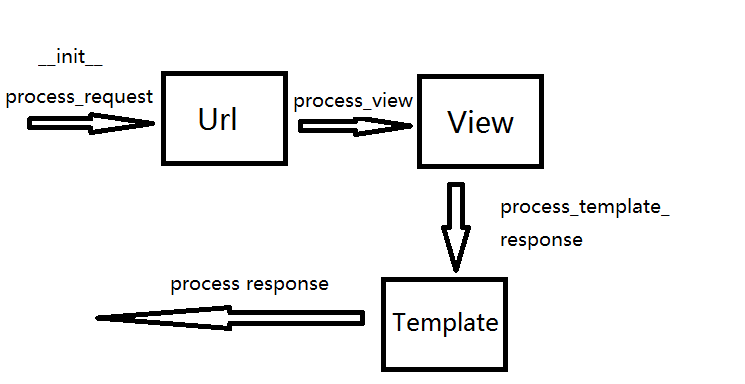

#中间件，分页和验证码
在django中提供了很多的插件功能，有利于开发者快速开发，比如中间件，分页器等 还提供了Pillow库，可以进行生成图片，用于登录的验证码图书设计。
## 中间件
### 1.中间件Middleware
中间件:

- a. 是一个轻量级的，底层的插件，可以介入Django的请求和响应的过程（面向切面编程)

- b. 中间件的本质就是一个python类

- c. 面向切面编程(Aspect Oriented Programming)简称AOP，AOP的主要实现目的是针对业务处理过程中的切面进行提取，它所面对的是处理过程中的某个步骤或阶段，以获取逻辑过程中各部分之间低耦合的隔离效果

### 2.中间件的处理函数

- **\_\_init__：**没有参数，在服务器响应的第一个请求的时候自动调用，用户确定时候启动该中间件

- **process\_request(self, request):** 在执行视图前被调用，每个请求上都会被调用，不主动进行返回或返回HttpResponse对象

- **process\_view(self, request, view_func,view_args, view_kwargs):**调用视图之前执行，每个请求都会调用，不主动进行返回或返回HttpResponse对象

- **process\_template\_response(self, request, response)：**在视图刚好执行完后进行调用，每个请求都会调用，不主动进行返回或返回HttpResponse对象

- **process\_response(self, request, response):**所有响应返回浏览器之前调用，每个请求都会调用，不主动进行返回或返回HttpResponse对象

- **process\_exception(self, request, exception):**当视图抛出异常时调用，不主动进行返回或返回HttpResponse对象

### 3.处理流程

### 4.自定义中间件流程
- a.在工程目录下创建utils文件夹，专门存放一些利于开发效率的工具

- b.在utils中创建一个新的python文件

- c.根据功能需求，创建切入需求类，重写切入点方法

格式如下
    
	
	from django.utils.deprecation import MiddlewareMixin	
	
	class AuthUserMiddleWare(MiddlewareMixin):
		
		def process_request(self, request):
     		print(‘xxxx’)
### 5.中间件的小练习
#### a.统一验证登录
    
	from django.http import HttpResponseRedirect
	from django.utils.deprecation import MiddlewareMixin
	
	from uauth.models import Users
	
	
	class AuthMiddleware(MiddlewareMixin):
	
	    def process_request(self, request):
	
	        # 统一验证登录
	        # return None 或者不写
	        if request.path == '/uauth/login/' or request.path == '/uauth/regist/':
	            return None
	        ticket = request.COOKIES.get('ticket')
	        if not ticket:
	            return HttpResponseRedirect('/uauth/login/')
	        users = Users.objects.filter(u_ticket=ticket)
	        if not users:
	            return HttpResponseRedirect('/uauth/login/')
	
	        request.user = users[0]
#### b.统计所有url访问次数
    
	from django.utils.deprecation import MiddlewareMixin

	from stu.models import Visit
	

	class CountView(MiddlewareMixin):
	
	    def process_request(self, request):
	        path = request.path
	        try:
	            visit = Visit.objects.get(v_url=path)
	            if visit:
	                visit.v_times += 1
	                visit.save()
	        except Exception as e:
	            print(e)
	            Visit.objects.create(v_url=path, v_times=1)
## 分页
### 1.分页的基本语法
django提供了分页的工具，在django.core中,先导入Paginator
    
	from django.core.paginator import Paginator
### 2.属性和方法
#### a.Paginator对象
    
	对象创建：Paginator(数据集，每一页数据)
属性:
    
	count  计算和

	num_pages: 页面总和
	
	page_range: 页码列表，从1开始
方法：
	
	page(页码)：获取的一个page对象，页码不存在则抛出invalidPage的异常
常见错误:
    
	invalidPage：page()传递无效页码

	PageNotAnInteger：Page()传递的不是整数
	
	Empty:page()传递的值有效，但是没有数据

#### b.page对象
    
	对象获取，通过Paginator的page()方法获得
属性：
    
	object_list: 当前页面上所有的数据对象

	number： 当前页的页码值

	paginator: 当前page关联的Paginator对象
方法:
    
	has_next()   判断是否有下一页

	has_previous():  判断是否有上一页

	has_other_pages():  判断是否有上一页或下一页

	next_page_number();  返回下一页的页码

	previous_page_number(): 返回上一页的页码

	len(): 返回当前也的数据的个数
### 3.实现方法
    
	def stuPage(request):
	    if request.method == 'GET':
	        page_id = request.GET.get('page_id', 1)
	        stus = Student.objects.all()
	        # 1表示一页有1条数据
	        paginator = Paginator(stus, 1)
			# 展示page为page_id页的信息
	        page = paginator.page(int(page_id))
	        return render(request, 'index_page.html', {'stus': page})
### 4.页面解析

	
        姓名: {{ stu.s_name }}
        电话: {{ stu.s_tel }}
        地址: {{ stu.studentinfo.i_addr }}
        头像:
        
        
        

         
    
    <h4>一共{{ stus.paginator.num_pages }}页</h4>
    <h4>一共{{ stus.paginator.count }}条数据</h4>
    <h5>
        
            
                <a href="/stu/stupage/?page_id={{ i }}">{{ i }}</a>
            
                {{ i }}
            
        
    </h5>

    
        <a href="/stu/stupage/?page_id={{ stus.previous_page_number }}">上一页</a>
        <a href="/stu/stupage/?page_id={{ stus.number | add:-1 }}">{{ stus.number | add:-1 }}</a>
    
    {{ stus.number }}
    
        <a href="/stu/stupage/?page_id={{ stus.number | add:1 }}">{{ stus.number | add:1 }}</a>
        <a href="/stu/stupage/?page_id={{ stus.next_page_number }}">下一页</a>
    

## 验证码
在用户登录，注册以及一些敏感操作的时候，我们为了防止服务器被暴力请求，或爬虫爬取，我们可以使用验证码进行过滤，减轻服务器的压力。

验证码需要使用绘图Pillow:
    
	Pip install Pillow

核心：
    
	image.ImageDraw.ImageFont

绘制流程：
    
	background = (10,20,30)  RGB颜色

	初始化画布 
	image = Image.new(‘RGB’,(100,50), background)
	
	获取画布中画笔对象
	draw = ImageDraw.Draw(image, ‘RGB’)
	
	绘制验证码，随机四个
	导入字体文件path表示路径
	font = ImageFont.truetype(‘path’, size)
	
	fontcolor = (20,40,60)
	draw.text((x,y), ‘R’, font.fontcolor)  x,y是文字左上角坐标
	
# 日志信息
在django中对日志记录提供了很好的支持，日志文件在开发环境中以及在线上环境或者在测试环境中都可以很好的反应程序的执行情况，以及出现bug的时候，准确的定位bug的位置，请求方法，错误原因等。所以说日志对于程序猿来说是一个开发者必备的必须了解且精通的东西。
## 日志logging模块
logging模块可以收集记录错误，警告等调试信息，在程序中可以捕获这些信息，并且甚至可以将错误的重要信息等都可以通过邮件发送给开发者
### 1.logging的组成
- Loggers

- Handlers

- Filters

- Formatters

### 2.Loggers
Logger 为日志系统的入口。每个logger 是一个具名的容器，可以向它写入需要处理的消息。

每个logger 都有一个日志级别。日志级别表示该logger 将要处理的消息的严重性。

Python 定义以下几种日志级别：
    
	DEBUG：用于调试目的的底层系统信息

	INFO：普通的系统信息
	
	WARNING：表示出现一个较小的问题。
	
	ERROR：表示出现一个较大的问题。
	
	CRITICAL：表示出现一个致命的问题。
日志级别等级CRITICAL > ERROR > WARNING > INFO > DEBUG > NOTSET

### 3.Handlers
Handler 决定如何处理logger 中的每条消息。它表示一个特定的日志行为。

与logger 一样，handler 也有一个日志级别。如果消息的日志级别小于handler 的级别，handler 将忽略该消息。

Logger 可以有多个handler，而每个handler 可以有不同的日志级别。

### 4.Filters
Filter 用于对从logger 传递给handler 的日志记录进行额外的控制。

### 5.Formatters
日志记录需要转换成文本。

Formatter 表示文本的格式。Fomatter 通常由包含日志记录属性的Python 格式字符串组成；

你也可以编写自定义的fomatter 来实现自己的格式。

如下展示了formatters格式: 

## 配置logging模块
在settings.py文件中配置

### 1.创建日志所在目录
    
	# 创建日志的路径
	LOG_PATH = os.path.join(BASE_DIR, 'log')
	# 如果地址不存在, 则自动创建log文件夹
	if not os.path.isdir(LOG_PATH):
	    os.mkdir(LOG_PATH)

### 2.定义LOGGING的格式
    
	LOGGING = {
	    # version只能为1
	    'version': 1,
	    # True表示禁用loggers
	    'disable_existing_loggers': False,
	
	    # 日志的文本格式
	    'formatters': {
	        'default': {
	            'format': '%(levelno)s  %(funcName)s  %(asctime)s %(message)s'
	        },
	        'simple': {
	            'format': '%(levelno)s %(module)s %(created)s %(message)s'
	        },
	
	    },
	    
	    # 特定的日志行为
	    'handlers': {
	        'stu_handlers': {
	            # 如果loggers的处理级别小于handlers的处理级别，则handler忽略该信息
	            'level': 'DEBUG',
	            # 指定文件类型为RotatingFileHandler,当日志文件的大小超过了maxBytes以后, 就会自动切割
	            'class': 'logging.handlers.RotatingFileHandler',
	            # 日志文件指定为5M, 超过5M重新备份,然后写入新的日志文件
	            'maxBytes': 5 * 1024 * 1024,
	            # 输出文件地址
	            'filename': '%s/log.txt' % LOG_PATH,
	            # 使用哪一个日志格式化的配置
	            'formatter': 'default',
	        },
	        'uauth_handlers': {
	            'level': 'DEBUG',
	            'class': 'logging.handlers.RotatingFileHandler',
	            'maxBytes': 5 * 1024 * 1024,
	            'filename': '%s/uauth_log.txt' % LOG_PATH,
	            'formatter': 'simple',
	        }
	    },
	
	    # 注意loggers的level的级别一定要大于handlers的级别, 否则handlers会忽略掉该信息的
	    'loggers': {
	        'stu': {
	            'handlers': ['stu_handlers'],
	            'level': 'INFO',
	            # propagate=0, 表示输出日志, 但消息不传递
	            # propagate=1, 表示输出日志的同时消息往更高级别的地方传递。root为最高级别。
	            'propagate': False
	        },
	        'auth': {
	            'handlers': ['uauth_handlers'],
	            'level': 'INFO'
	        }
	    },
	
	    'filters': {
	
	    }
	}

### 3.使用logging打印日志
    
	import logging

	logger = logging.getLogger('stu')

	def index(request):
	    if request.method == 'GET':
			# 获取所有学生信息
	        stuinfos = StudentInfo.objects.all()
	        logger.info('url: %s method: %s 获取学生信息成功' % (request.path, request.method))
	        return render(request, 'index.html', {'stuinfos': stuinfos})

### 4.查看log文件中日志打印的记录
    
	20  index  2018-05-03 15:28:15,292 url: /stu/index/ method: GET 
	20  index  2018-05-03 15:46:01,665 url: /stu/index/ method: GET 
	20  index  2018-05-03 15:53:11,418 url: /stu/index/ method: GET