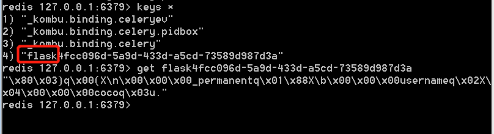

# flask使用操作进阶

### 1. 请求request

服务端在接收到客户端的请求后，会自动创建Request对象

由Flask框架创建，Request对象不可修改

属性：

	url：完整的请求地址

	base_url：去掉GET参数的url

	host_url：只有主机和端口号的url

	path：路由中的路径

	method：请求方法

	remote_addr：请求的客户端的地址

	args：GET请求参数

	form：POST请求参数

	files：文件上传

	headers：请求头

	cookies：请求中的cookie

#### 1.1 args-->GET请求参数包装
	
a）args是get请求参数的包装，args是一个ImmutableMultiDict对象，类字典结构对象
	
b）数据存储也是key-value

#### 1.2 form-->POST请求参数包装

a）form是post请求参数的包装，args是一个ImmutableMultiDict对象，类字典结构对象
	
b）数据存储也是key-value

重点：ImmutableMultiDict是类似字典的数据结构，但是与字典的区别是，可以存在相同的键。在ImmutableMultiDict中获取数据的方式，dict['key']或者dict.get('key')或者dict.getlist('key')

### 2. 响应Response

Response是由开发者自己创建的

创建方法：
	
	from flask import make_response

	make_response创建一个响应，是一个真正的Response对象

状态码：

格式：make_reponse(data，code)，其中data是返回的数据内容，code是状态码

	a）直接将内容当做make_response的第一个参数，第二个参数直接写返回的状态码

 	b）直接在render后加返回的状态码

例子1：

定义一个获取GET请求的request的方法，并将返回成功的请求的状态码修改为200

	@blue.route('/getrequest/', methods=['GET'])
	def get_request():

	    print(request)
	
	    return '获取request', 200

例子2：

返回response响应，并添加返回结果的状态码200

	@blue.route('/getresponse/')
	def get_response():
	    response = make_response('<h2>我是响应</h2>', 500)
	    return response

### 3. 重定向/反向解析

	url_for('蓝图定义的名称.方法名')

例子1:

定义跳转方法，跳转到get_response的方法上

		
	@blue.route('/getredirect/')
	def get_redirect():
	
	    return redirect('getresponse')

例子2：

使用url_for反向解析

	from flask import redirect, url_for

	@blue.route('/getredirect/')
	def get_redirect():
	
	    return redirect(url_for('first.get_response'))

### 4. 终止/异常捕获

自动抛出异常：abort(状态码)

捕获异常处理：errorhandler(状态码)，定义的函数中要包含一个参数，用于接收异常信息

#### 4.1 定义终止程序
	
	@blue.route('/make_abort/')
	def get_abort():
	    abort(400)
	    return '终止'

#### 4.2 捕获定义的异常

	@blue.errorhandler(400)
	def handler(exception):
	
	    return '捕获到异常信息:%s' % exception

# flask中的session/cookie

### 1. Cookie

概念：

	a）客户端会话技术，浏览器的会话技术

	b）数据全部存储在客户端中

	c）存储使用的键值对结构进行存储

	特性：
		支持过期时间
		默认会自动携带本网站的cookie
		不能跨域名
		不能跨浏览器

创建：

	Cookie是通过服务器创建的Response来创建的

	设置：set_cookie('key', value, max_ages='')

	删除：del_cookie('key')

例子1：

	@blue.route('/setcookie/')
	def set_cookie():
	    temp = render_template('index.html')
	    response = make_response(temp)
	    response.set_cookie('name','cocoococo')
	    return response

### 2. Session

flask-session是flask框架的session组件

该组件则将支持session保存到多个地方

如：

	redis：保存数据的一种工具，五大类型。非关系型数据库
	
	memcached
	
	mongodb
	
	sqlalchmey：那数据存到数据库表里面

#### 2.1 安装

	pip install flask-session

如果指定存session的类型为redis的话，需要安装redis

	pip install redis

#### 2.2 使用

我们在初始化文件中创建一个方法，通过调用该方法来获取到Flask的app对象
	
	def create_app():
	    app = Flask(__name__)
	    # SECRET_KEY 秘钥
	    app.config['SECRET_KEY'] = 'secret_key'
		# session类型为redis
	    app.config['SESSION_TYPE'] = 'redis'
		# 添加前缀
    	app.config['SESSION_KEY_PREFIX'] = 'flask'
	    
	    # 加载app的第一种方式
	    se = Session()
	    se.init_app(app=app)
	    #加载app的第二种方式
	    Session(app=app)
	    app.register_blueprint(blueprint=blue)
	
	    return app

#### 2.3 案例

定义一个登陆的方法，post请求获取到username，直接写入到redis中，并且在页面中展示出redis中的username

a）需要先启动redis，开启redis-server，使用redis-cli进入客户端

b）定义方法

	@blue.route('/login/', methods=['GET', 'POST'])
	def login():
	    if request.method == 'GET':
	        username = session.get('username')
	        return render_template('login.html', username=username)
	    else:
	        username = request.form.get('username')
	        session['username'] = username
	
	        return redirect(url_for('first.login'))

c）定义模板
	
	<body>
	<h3>欢迎:{{ username }}</h3>
	<form action="" method="POST">
	    用户名:<input type="text" name="username" placeholder="请输入你的名字">
	    <input type="submit" value="提交">
	</form>
	</body>

d）redis中数据

注意：我们在定义app.config的时候指定了SESSION_KEY_PREFIX为flask，表示存在session中的key都会加一个前缀名flask