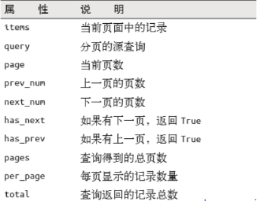

# flask模型2

### 1. 深入数据库增删改查

定义模型，并定义初始化的函数：

	class Student(db.Model):
	
	    s_id = db.Column(db.Integer, primary_key=True, autoincrement=True)
	    s_name = db.Column(db.String(16), unique=True)
	    s_age = db.Column(db.Integer, default=1)
	
	    __tablename__ = "student"
	
	    def __init__(self, name, age):
	        self.s_name = name
	        self.s_age = age

#### 1.1 增--批量增加

第一种方式：

	@blue.route('/createstus/')
	def create_users():
	    stus = []
	    for i in range(5):
			# 实例化Student的对象
	        s = Student()
			# 对象的属性赋值
	        s.s_name = '张三%s' % random.randrange(10000)
	        s.s_age = '%d' % random.randrange(100)
	        stus.append(s)
		# 添加需要创建的数据
	    db.session.add_all(stus)
		# 提交事务到数据库
	    db.session.commit()
	
	    return '创建成功'

注：在创建单条数据的时候使用db.session.add()，在创建多条数据的时候使用db.session.add_all()

第二种方式：

	@blue.route('/createstus/')
	def create_users():
	    stus = []
	    for i in range(5):
			# 使用类的初始化去创建Student对象
	        s = Student('张三%s' % random.randrange(10000),
	                    '%d' % random.randrange(100))
	        stus.append(s)
	
	    db.session.add_all(stus)
	    db.session.commit()
	
	    return '创建成功'

#### 1.2 查--使用运算符

获取查询集
	
	filter(类名.属性名.运算符(‘xxx’))

	filter(类名.属性 数学运算符  值)

运算符：

	contains： 包含
	startswith：以什么开始
	endswith：以什么结束
	in_：在范围内
	like：模糊
	__gt__: 大于
	__ge__：大于等于
	__lt__：小于
	__le__：小于等于

筛选：
	
	offset()
	
	limit()
	
	order_by()
	
	get()
	
	first()
	
	paginate()

逻辑运算：

	与
		and_
		filter(and_(条件),条件…)
	
	或
		or_
		filter(or_(条件),条件…)
	
	非
		not_
		filter(not_(条件),条件…)

例子1：

1. 查询学生的id为3，4，5，6，16的的学生信息，使用<b>in_逻辑运算</b>

		@blue.route('/getstubyids/')
		def get_stu_by_ids():
	
	    	students = Student.query.filter(Student.s_id.in_([3,4,5,6,16]))
	    	return render_template('StudentList.html', students=students)

2. 查询学生的年龄小于18岁的学生的信息
	
		Student.query.filter(Student.s_age < 18)

3. 查询学生的年龄小于18岁的学生的信息，<b>\_\_lt\_\_小于</b>
 
		students = Student.query.filter(Student.s_age.__lt__(15))

4. 查询学生的年龄小于等于18岁的学生的信息，<b>\_\_le\_\_小于等于</b>

		students = Student.query.filter(Student.s_age.__le__(15))

5. 查询学生的姓名以什么开始或者以什么结尾的学生的信息<b>startswith和endswith</b>

    	students = Student.query.filter(Student.s_name.startswith('张'))
    	students = Student.query.filter(Student.s_name.endswith('2'))

6. 查询id=4的学生的信息

		Student.query.get(4)
		获取的结果是学生的对象

7. 分页，查询第二页的数据4条
		
		第一个参数是那一页，第二个参数是一页的条数，第三个参数是是否输出错误信息
		students = Student.query.paginate(2, 4, False).items

例子2：
	
跳过offset几个信息，截取limit结果的几个值

	students = Student.query.limit(5)
    students = Student.query.order_by("-s_age")
    students = Student.query.offset(15)
    students = Student.query.all()

    students = Student.query.offset(5).order_by("-id")
    students = Student.query.order_by("-id").limit(5).offset(5)
    students = Student.query.order_by("-id").limit(5)

例子3：

1. 查询

	students = Student.query.filter(and\_(Student.s_age==18, Student.s_name=='雅典娜'))

    students = Student.query.filter(or\_(Student.s_age==18, Student.s_name=='雅典娜'))

    students = Student.query.filter(not\_(Student.s_age==18))

例子4：

分页：

	
	paginate = Student.query.paginate(1, 10, False)
    
	students = paginate.items

	{{ paginate.has_prev }}
	{{ paginate.prev_num }}
	{{ paginate.has_next }}
	{{ paginate.next_num }}
	{{ paginate.pages }}
	{{ paginate.per_page }}
	
	
	    {{ p }}
	
	
	
### 2. 关联关系

#### 2.1 一对多建立模型

学生模型：

	class Student(db.Model):
	
	    s_id = db.Column(db.Integer, primary_key=True, autoincrement=True)
	    s_name = db.Column(db.String(20), unique=True)
	    s_age = db.Column(db.Integer, default=18)
	    s_g = db.Column(db.Integer, db.ForeignKey('grade.g_id'), nullable=True)
	
	    __tablename__ = 'student'

班级模型：

	class Grade(db.Model):

	    g_id = db.Column(db.Integer, primary_key=True, autoincrement=True)
	    g_name = db.Column(db.String(10), unique=True)
	    g_desc = db.Column(db.String(100), nullable=True)
	    g_time = db.Column(db.Date, default=datetime.now)
	    students = db.relationship('Student', backref='stu', lazy=True)
	
	    __tablename__ = 'grade'

#### 2.2

1. 通过班级查询学生信息

	@grade.route('/selectstubygrade/<int:id>/')
	def select_stu_by_grade(id):
	    grade = Grade.query.get(id)
		# 通过班级对象.定义的relationship变量去获取学生的信息
	    stus = grade.students
	
	    return render_template('grade_student.html',
	                           stus=stus,
	                           grade=grade
	                           )

2. 通过学生信息查询班级信息

	@stu.route('/selectgradebystu/<int:id>/')
	def select_grade_by_stu(id):
	
	    stu = Student.query.get(id)
		# 通过学生对象.定义的backref参数去获取班级的信息
	    grade = stu.stu
	
	    return render_template('student_grade.html',
	                           grade=grade,
	                           stu=stu)

注意：表的外键由db.ForeignKey指定，传入的参数是表的字段。db.relations它声明的属性不作为表字段，第一个参数是关联类的名字，backref是一个反向身份的代理,相当于在Student类中添加了stu的属性。例如，有Grade实例dept和Student实例stu。dept.students.count()将会返回学院学生人数;stu.stu.first()将会返回学生的学院信息的Grade类实例。一般来讲db.relationship()会放在一这一边。

### 3. 数据库迁移

在django中继承了makemigrations，可以通过migrate操作去更新数据库，修改我们定义的models，然后在将模型映射到数据库中。

在flask中也有migrate操作，它能跟踪模型的变化，并将变化映射到数据库中

#### 2.1 安装migrate

	pip install flask-migrate

#### 2.2 配置使用migrate

##### 2.2.1 初始化，使用app和db进行migrate对象的初始化

	from flask_migrate import Migrate

	#绑定app和数据库
    Migrate(app=app, db=db)

##### 2.2.2 安装了flask-script的话，可以在Manager()对象上添加迁移指令

	from flask_migrate import Migrate, MigrateCommand

	app = Flask(__name__)

	manage = Manager(app=app)

	manage.add_command('db', MigrateCommand)

操作：

	python manage.py db init  初始化出migrations的文件，只调用一次

	python manage.py db migrate  生成迁移文件

	python manage.py db upgrade 执行迁移文件中的升级
	
	python manage.py db downgrade 执行迁移文件中的降级

	python manage.py db --help 帮助文档

# flask模型3

### 1. 关联关系---多对多

定义模型：
	

引入SLALchemy
	
	from flask_sqlalchemy import SQLAlchemy
	
	db = SQLAlchemy()

创建中间表

	
	sc = db.Table('sc',
	    db.Column('s_id', db.Integer, db.ForeignKey('student.s_id'), primary_key=True),
	    db.Column('c_id', db.Integer, db.ForeignKey('courses.c_id'), primary_key=True)
	)

创建学生类Student

	class Student(db.Model):
	
	    s_id = db.Column(db.Integer, primary_key=True, autoincrement=True)
	    s_name = db.Column(db.String(20), unique=True)
	    s_age = db.Column(db.Integer, default=18)
	    s_g = db.Column(db.Integer, db.ForeignKey('grade.g_id'), nullable=True)
	
	    __tablename__ = 'student'
	
	    def __init__(self, name, age):
	
	        self.s_name = name
	        self.s_age = age
	        self.s_g = None
	

创建课程表的模型，Course类
	
	class Course(db.Model):
	
	    c_id = db.Column(db.Integer, primary_key=True, autoincrement=True)
	    c_name = db.Column(db.String(20), unique=True)
	    students = db.relationship('Student',
	                               secondary=sc,
	                               backref='cou')
	
	    __tablename__ = 'courses'
	
	    def __init__(self, name):
	
	        self.c_name = name

sc表由**db.Table声明**，我们不需要关心这张表，因为这张表将会由SQLAlchemy接管，它唯一的作用是作为students表和courses表关联表，所以必须在db.relationship()中指出**sencondary关联表参数**。lazy是指查询时的惰性求值的方式，这里有详细的参数说明，而db.backref是声明反向身份代理，其中的lazy参数是指明反向查询的惰性求值方式.

### 2. 添加学生和课程之间的关系

通过页面中传递学生的id和课程的id，分别获取学生的对象和课程的对象，在使用关联关系append去添加学生对象，并且add以后再commit后，就可以在中间表sc中查看到新增的关联关系了。

		userid = request.form.get('userid')
        courseid = request.form.get('courseid')

        stu = Student.query.get(userid)
        cou = Course.query.get(courseid)

        cou.students.append(stu)
        db.session.add(cou)
        db.session.commit()

### 3. 删除学生和课程之间的关系

通过页面获取传递的学生的id和课程的id，分别获取学生对象和课程对象，在使用关联关系remove去删除学生对象，并commit将事务提交到数据库中	
	
	stu = Student.query.get(s_id)
    cou = Course.query.get(c_id)

    cou.students.remove(stu)
    db.session.commit()

### 4. 通过课程查询学生的信息

以下定义在课程course的模型中，所以通过课程查询学生的信息，语法为课程的对象.studengs。如果知道学生的信息反过来找课程的信息，则使用backref的反向关联去查询，语语法为学生的对象.cou(反向)

students = db.relationship('Student',secondary=sc,backref='cou')

    cou = Course.query.get(2)
    stus = cou.students

### 5. 通过学生去查询课程的信息

    stu = Student.query.get(id)
    cous = stu.cou

